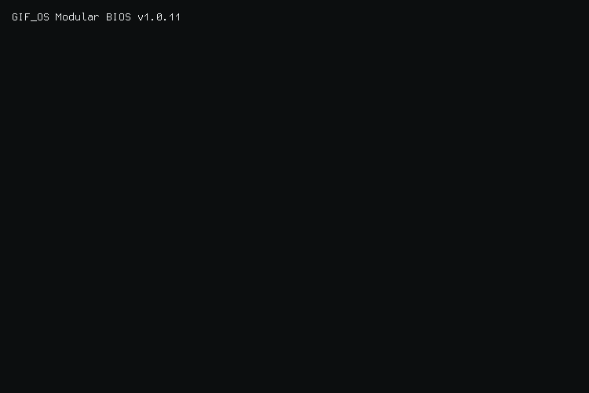

<!-- GIFOS:START -->

  <picture>
    <source media="(prefers-color-scheme: dark)" srcset="./output.gif">
    <source media="(prefers-color-scheme: light)" srcset="./output.gif">
    
  </picture>
   
  <i>Gerado com <a href="https://github.com/x0rzavi/github-readme-terminal">github-readme-terminal</a> em Tue Sep 29 11:23:20 AM UTC-03:00 2026</i>

<!-- GIFOS:END -->

  

---

  
  
  

